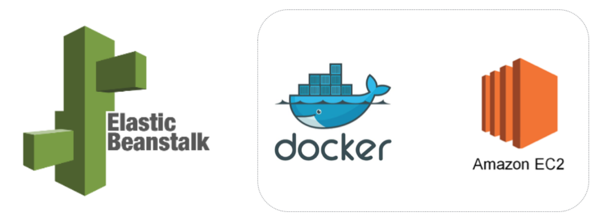

# Deploying a Docker Container to AWS with Elastic Beanstalk



Prerequisites:
- Create an AWS account. AWS offers a free tier with access to a lot of cool services such as Amazon EC2 and S3.
- Install the Elastic Beanstalk (EB) command line tool [`awsebcli`](https://docs.aws.amazon.com/elasticbeanstalk/latest/dg/eb-cli3-install.html)
- Install the latest version of [`Node.js`](https://nodejs.org/en/download/)
- Install [`Docker`](https://www.docker.com/get-started) 

### Create Node.js application
```bash
. ci-nodeapp
├── app.js
└── package.json
```

- Open a command prompt and change into your project’s root directory. Initialize your project by running `npm init -f.`
- After running the initialize function, npm will create a `package.json`
- Create a new file in your project’s root directory called `app.js`
- Install our dependencies using `npm install --save express morgan`, which will install and add our dependencies to the package.json
- Add a start script to the scripts section of the package.json which we will need to use in the dockerization step: `"start": "node app.js"`
- Run the application `npm start` and go to http://localhost:8080

### Dockerize the application
```bash
. ci-nodeapp
├── .dockerignore
├── Dockerfile
├── app.js
├── node_modules
├── package-lock.json
└── package.json
```

- Create a `Dockerfile`
- Add `.dockerignore`
- Build a docker image `docker build -t nodejs-app .`
- Run the docker image `docker run -d -p 8080:8080 --name nodejs-app nodejs-app`


### Push docker image to DockerHub or Amazon ECR 

DockerHub
```bash
# login to you docker hub account
> docker login

# check image id
> docker images

# tag and push the application image to docker hub
> docker tag <imageId> chicalicdan/ci-nodeapp:latest
> docker push chicalicdan/ci-nodeapp
```

AWS ECR 
> Create image repository first on you AWS account. Go to ECS > Amazon ECR > Repositories > `ci-nodeapp`
> Ensure you have installed the latest version of the AWS CLI. Check [ECR documentation](https://docs.aws.amazon.com/AmazonECR/latest/userguide/ECR_GetStarted.html)
```bash
# login to AWS ECR
> $(aws ecr get-login --no-include-email --region us-east-2)

# check image id
> docker images

# tag and push the application image to AWS ECR
> docker tag ci-nodeapp:latest accountid.dkr.ecr.us-east-2.amazonaws.com/ci-nodeapp:latest
> docker push accountid.dkr.ecr.us-east-2.amazonaws.com/ci-nodeapp:latest
```

### Create AWS Elastic Beanstalk environment
> The following command will build the stack or you can create the environment using your AWS console.
> If all went well you now have containerized services stack running under elastic beanstalk.
```bash
eb create <YOUR ENVIRONMENT NAME> --profile <YOUR AWS PROFILE NAME> -i t2.small -p "multi-container-docker-1.11.2-(generic)" -s -k <YOUR AWS KEYPAIR NAME>"  
```

### Pull the image from DockerHub or AWS ECR 

DockerHub
```bash
> docker login
> cat ~/.docker/config.json

{
	"auths": {
		"https://index.docker.io/v1/": {
			"auth": "******"
		}
	},
	"HttpHeaders": {
		"User-Agent": "Docker-Client/18.06.1-ce (darwin)"
	},
	"stackOrchestrator": "swarm"
}

## Create `dockercfg.json` config file
> vi dockercfg.json
{    
    "https://index.docker.io/v1/" : {
        "auth": "********",
        "email" : "yourusername"
    }
}

## Create a S3 repository then upload your `dockercfg.json`
## Make sure to enable encryption:

AES-256
Use Amazon S3 server-side encryption to encrypt your data. 

## Create Dockerrun.aws.json on project dir
{
  "AWSEBDockerrunVersion": "1",
  "Authentication": {
    "Bucket": "s3-bucket-nae",
    "Key": "dockercfg.json"
  },
  "Image": {
    "Name": "chicalicdan/ci-nodeapp:latest",
    "Update": "true"
  },
  "Ports": [
    {
      "ContainerPort": "3000"
    }
  ],
  "Logging": "/var/log"
}
```

AWS ECR
> When using AWS ECR, no need to create authentication file on S3 just make sure to allow your EB `instance profile role` to have `AmazonEC2ContainerRegistryReadOnly` policy
```bash
## Create Dockerrun.aws.json on project dir
{
  "AWSEBDockerrunVersion": "1",
  "Image": {
    "Name": "accountid.dkr.ecr.us-east-2.amazonaws.com/ci-nodeapp:latest",
    "Update": "true"
  },
  "Ports": [
    {
      "ContainerPort": "3000"
    }
  ],
  "Logging": "/var/log/"
}
```


